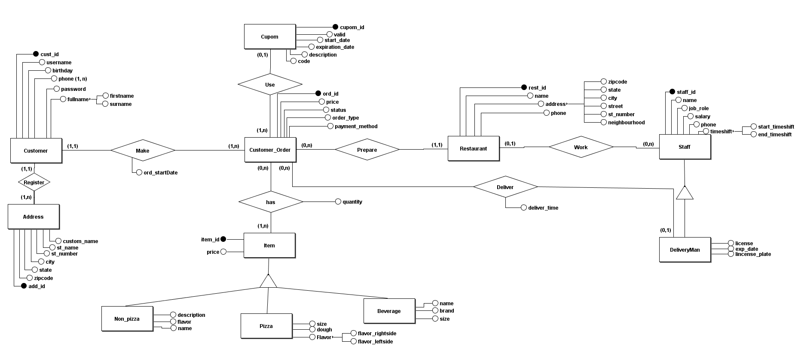

#  PizzaFranchiseDatabase

### Project Description :
In this project I’ve created a relational database in Postgres that simulates the operations of a pizza franchise. Specifically, I have designed the database from scratch starting with the business understanding of the problem to the physical project therefore, doing a full cycle in database design (conceptual model to physical model). To populate the database I've used python scripts to generate “real” data and to simulate interaction with this database I've used cron jobs to schedule batches of data being ingested by the database. Other than that, I've created Users and Roles to manage access to the database and created procedures, triggers and backups to practice my Postgres understanding.

### Project objective : 
Prove SQL administration knowledge :
 * Database Thinking 
 * Database Design (ER -> tableSchema -> SQL)
 * Database Creation
 * User-Role Management
 * Schema Creation
 * Views Creation
 * Triggers and Procedures
 * Backups

### Pizza website contents :
* The Franchise has Coupons (Only one can be used by order)
* The Franchise has a lot of restaurants in brazil and alot of employees
* The Franchise a small menus with four types of food(Pizzas, Sandwiches, Desserts and Beverages)
* The Franchise has a login system that allow customersto create users with their personal information
* The Franchise allow users to register multiple creditcards and addresses.

### The flow of ordering a pizza inside pizza website.
1) Customers open pizza franchise website and click on“Start Order”.
2) Choose order type : Delivery or Carryout.
3) Customer Login / Register in account.
4) Create account with personal information:  
    A) Firstname, Surname, Birthday and phonenumber  
    B) Register address with personalized name zipcode, state, street, number andaditional_information.  
    C) Register payment methods.
5) Pick menu items (choose Pizza)  
    A) pick main flavor (Pizza can have 2 flavors)  
    B) pick dough and size.  
6) Choose address and payment method
7) Wait for the pizza to be delivered by the pizzadelivery man.

### Additional information :
* This pizza franchise has many restaurants distributed in brazil each with their information. Such as phone number, address,opening time and staff.
* Each pizza restaurant has its own staff with their information.
* Some employees work as pizza delivery men and deliver pizzas.

### Entity–Relationship Diagram :

### Resulting Table Schema :

### Project Steps 

1) Create Database and the tables corresponding to the Table Schema.
2) Insert simulated data into database.
2-2) Create python scripts to generate data.
3) Create Users / Roles examples.
4) Create Views that restrict database.
5) Create Procedures examples.
6) Create Triggers examples.
7) Create Backups.
8) Create Cron Jobs

### Users - Roles

 In this project there are 3 Roles (Manager, Developer and Intern):
* Manager -> Can only look at specific views that are related to their restaurant (CashFlow and EmployeeList).
* Developer -> Can insert and update freely in the database.
* Intern -> Can only look the database and can't interfer with the operation.

Users:
* (rio_manager, niteroi_manager, saopaulo_manager, vitoria_manager, belohorizonte_manager) Belongs to Manager Role.
* (david_dev) Belongs to Developer Role.
* (robert_intern) Belongs to Intern Role.

